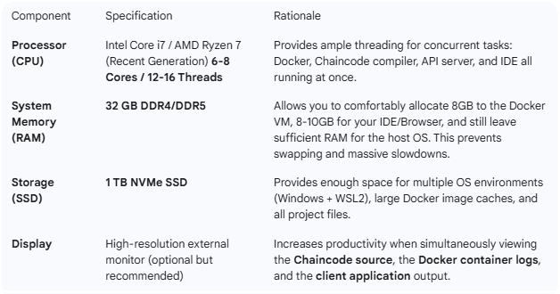

## Recommended/Ideal Setup (High Performance and Productivity)
This setup provides a much smoother experience, faster Chaincode deployment, and the ability to run larger, more complex test networks (e.g., 2 Org network with 4 Peers) without slowdowns.



# Deployment


The process of connecting multiple hardware devices (servers) to form your live Hyperledger Fabric system relies on **Kubernetes (K8s) for cluster creation and networking**, and a **Virtual Private Cloud (VPC) network** to link them.

You do not manually connect your Hyperledger Fabric nodes (Peers, Orderers) to each other; you connect the **underlying servers** and let Kubernetes handle the rest.

Here is the step-by-step process:

---

## 1. Establish the Multi-Node Cluster Environment

The first step is to provision and connect the physical/virtual machines that will host your network.

### A. Provision Hardware/VMs

Acquire multiple servers. For a live environment, you would use:

* **Cloud Virtual Machines (VMs):** Recommended for flexibility (e.g., AWS EC2, Google Compute Engine, Azure VMs).
* **On-Premise Servers:** Physical machines in your own data center.

### B. Secure Private Networking

The servers must be able to communicate securely and reliably with each other.

* **Virtual Private Cloud (VPC):** Create a VPC network (or equivalent private network) that spans all your servers. This network ensures that the machines are on the same logical network, can communicate using **private IP addresses**, and are isolated from the public internet (except where necessary).
* **Install Prerequisites:** On each server (now referred to as a **"node"**), you must install **Docker** and the required container runtime environment.

### C. Deploy the Kubernetes Cluster

Use a Kubernetes distribution (like EKS, GKE, AKS, or Kubeadm) to form a single, unified cluster out of your multiple servers.

* **Master/Control Plane Nodes:** A minimum of three nodes are typically dedicated to running the Kubernetes control plane.
* **Worker Nodes:** The remaining servers are designated as worker nodes, which is where your Hyperledger Fabric containers will actually run.

---

## 2. Deploying Hyperledger Fabric Components

Once the K8s cluster is active, you use Kubernetes objects to deploy and connect your Fabric components.

### A. Container Orchestration (Kubernetes Deployments)

You will use **Deployment** and **StatefulSet** objects in Kubernetes to launch your Fabric nodes as Docker containers:

* **Peers, Orderers, CAs:** Deploy these using `StatefulSet` objects. A StatefulSet is necessary because these nodes require stable network identities and **Persistent Storage** for their ledger data and crypto material.
* **Chaincode:** Chaincode containers are often managed by the Peer and spun up on demand.

### B. Internal Service Discovery (Kubernetes Services)

You need a reliable way for components to find each other within the cluster, regardless of which physical server they are running on.

* **Kubernetes Services:** You will define a **Service** for each component (e.g., `peer0-org1`, `orderer0-ordererorg`). A Service assigns a stable **DNS name** and **Virtual IP** to a set of running containers.
* For example, when Peer A needs to talk to Orderer B, it addresses it by its stable DNS name (e.g., `orderer0.ordererorg.svc.cluster.local`), and the Kubernetes Service automatically routes the traffic to the correct container, no matter which physical server it's on.


### C. Persistent Storage for Data Integrity

As previously mentioned, Hyperledger Fabric nodes are stateful.

* **Persistent Volumes (PVs):** You must provision a Persistent Volume for each stateful node (Peers, Orderers, Databases). Kubernetes manages connecting a **Persistent Volume Claim (PVC)** from the container to the actual storage on your cloud provider (e.g., EBS, GCE Persistent Disks) or your data center's storage system. This ensures the **Immutable Ledger for POS Payments** data is safe even if the container or server node fails.

---

## 3. External Connectivity (Exposing the Network)

For your client application (like a POS system frontend) to submit transactions, you need to expose certain services externally.

* **Ingress Controller / Load Balancer:** To connect your client application to the Peer/Orderer REST endpoints, you use a **Load Balancer** or an **Ingress Controller**. This K8s resource acts as a secure entry point, routing external traffic from a single public IP address to the correct internal Service running within your cluster. You would ensure this connection is secured using **TLS**.


For a **live production system**, you **absolutely require multiple physical or virtual devices/servers** to handle your Hyperledger Fabric nodes.

While you can run your entire network (Orderers, Peers, CAs, and Databases) on a single machine for **development** or **proof-of-concept (PoC)** testing (often using Docker Compose), this setup is fundamentally unsuitable for a production environment.

Here is a breakdown of why multiple devices are essential from your project's perspective:

### 1. Eliminating the Single Point of Failure (High Availability)

The primary reason for using multiple servers is to guarantee **Security and Availability**, a key need for your project.

* **Single Device Failure:** If your entire network resides on one physical server and that server fails (due to hardware issues, network outage, or maintenance), your entire POS payment ledger system goes down.
* **Decentralized Fault Tolerance:** By deploying your 3 Orderer nodes and 2 Peer nodes across **multiple distinct servers** (which form your Kubernetes cluster), the network can automatically continue processing transactions even if one or more servers fail.

### 2. Ensuring Consensus Mechanism Reliability

Your Orderer nodes must operate independently to achieve consensus on the order of transactions.

* **Raft Protocol:** Hyperledger Fabric often uses the Raft consensus algorithm, which is designed to maintain ledger consistency even if a minority of nodes fail (e.g., 1 failure in a 3-node set). This guarantee is entirely dependent on those 3 nodes being deployed on **independent servers**. If all 3 Orderer containers are on the same machine, a single power outage compromises all of them instantly, shattering the fault tolerance.

### 3. Scaling with Kubernetes

Deploying to Kubernetes is a commitment to a multi-node architecture, which is inherently designed for distributed workloads across a cluster of machines.

* **Cluster Nodes:** In a production setting, your Kubernetes cluster will consist of multiple underlying servers (called worker nodes). Kubernetes ensures that your Peer, Orderer, and Chaincode containers are intelligently scheduled across these different worker nodes, providing maximum isolation and availability.
* **Resource Management:** As your POS payment system grows, the load on your Peer nodes (especially the state database) and Orderer nodes will increase. A single server would quickly become a performance bottleneck. Spreading these services across multiple devices allows you to distribute the CPU, memory, and storage load, which directly supports your project's need for **Scalability**.

The process of connecting multiple hardware devices (servers) to form your live Hyperledger Fabric system relies on **Kubernetes (K8s) for cluster creation and networking**, and a **Virtual Private Cloud (VPC) network** to link them.

You do not manually connect your Hyperledger Fabric nodes (Peers, Orderers) to each other; you connect the **underlying servers** and let Kubernetes handle the rest.

Here is the step-by-step process:

---

## 1. Establish the Multi-Node Cluster Environment

The first step is to provision and connect the physical/virtual machines that will host your network.

### A. Provision Hardware/VMs

Acquire multiple servers. For a live environment, you would use:

* **Cloud Virtual Machines (VMs):** Recommended for flexibility (e.g., AWS EC2, Google Compute Engine, Azure VMs).
* **On-Premise Servers:** Physical machines in your own data center.

### B. Secure Private Networking

The servers must be able to communicate securely and reliably with each other.

* **Virtual Private Cloud (VPC):** Create a VPC network (or equivalent private network) that spans all your servers. This network ensures that the machines are on the same logical network, can communicate using **private IP addresses**, and are isolated from the public internet (except where necessary).
* **Install Prerequisites:** On each server (now referred to as a **"node"**), you must install **Docker** and the required container runtime environment.

### C. Deploy the Kubernetes Cluster

Use a Kubernetes distribution (like EKS, GKE, AKS, or Kubeadm) to form a single, unified cluster out of your multiple servers.

* **Master/Control Plane Nodes:** A minimum of three nodes are typically dedicated to running the Kubernetes control plane.
* **Worker Nodes:** The remaining servers are designated as worker nodes, which is where your Hyperledger Fabric containers will actually run.

---

## 2. Deploying Hyperledger Fabric Components

Once the K8s cluster is active, you use Kubernetes objects to deploy and connect your Fabric components.

### A. Container Orchestration (Kubernetes Deployments)

You will use **Deployment** and **StatefulSet** objects in Kubernetes to launch your Fabric nodes as Docker containers:

* **Peers, Orderers, CAs:** Deploy these using `StatefulSet` objects. A StatefulSet is necessary because these nodes require stable network identities and **Persistent Storage** for their ledger data and crypto material.
* **Chaincode:** Chaincode containers are often managed by the Peer and spun up on demand.

### B. Internal Service Discovery (Kubernetes Services)

You need a reliable way for components to find each other within the cluster, regardless of which physical server they are running on.

* **Kubernetes Services:** You will define a **Service** for each component (e.g., `peer0-org1`, `orderer0-ordererorg`). A Service assigns a stable **DNS name** and **Virtual IP** to a set of running containers.
* For example, when Peer A needs to talk to Orderer B, it addresses it by its stable DNS name (e.g., `orderer0.ordererorg.svc.cluster.local`), and the Kubernetes Service automatically routes the traffic to the correct container, no matter which physical server it's on.


### C. Persistent Storage for Data Integrity

As previously mentioned, Hyperledger Fabric nodes are stateful.

* **Persistent Volumes (PVs):** You must provision a Persistent Volume for each stateful node (Peers, Orderers, Databases). Kubernetes manages connecting a **Persistent Volume Claim (PVC)** from the container to the actual storage on your cloud provider (e.g., EBS, GCE Persistent Disks) or your data center's storage system. This ensures the **Immutable Ledger for POS Payments** data is safe even if the container or server node fails.

---

## 3. External Connectivity (Exposing the Network)

For your client application (like a POS system frontend) to submit transactions, you need to expose certain services externally.

* **Ingress Controller / Load Balancer:** To connect your client application to the Peer/Orderer REST endpoints, you use a **Load Balancer** or an **Ingress Controller**. This K8s resource acts as a secure entry point, routing external traffic from a single public IP address to the correct internal Service running within your cluster. You would ensure this connection is secured using **TLS**.


# Test network to production
*   **Security (The cryptogen tool):** The test network uses a tool called cryptogen. It’s like printing fake IDs at home—it just generates static files. In production, you must use a Fabric CA (Certificate Authority) which acts like a real government office issuing IDs dynamically.
* **Single-Host:** In the test network, all organizations live on your one laptop. In production, Org A would be in New York (AWS) and Org B would be in London (Azure).
Persistence: If you delete the Docker containers in the test network, your data often vanishes. Production uses external managed storage.
* **The "Raft" Ordering Service:** The test network often uses a simplified single-node "orderer." Production requires at least 3 or 5 orderer nodes for "High Availability" (so the network doesn't die if one server crashes).


# The Logical Flow: From Start to End Product
Here is the "Golden Thread" of how a Fabric system is built. It moves from Identity →  Infrastructure → Logic → User.
* Step 1: Configuration (The Blueprint)
Before turning on any computer, you define the network in a file called configtx.yaml.
What you do: List the Organizations (Org1, Org2), their MSP names, and who is allowed to be an "Orderer."
* Step 2: The CAs (The Passport Offices)
You start the CA servers.
What happens: Every Org gets its own CA. These are just "waiting" for someone to ask for an ID.
* Step 3: MSP Generation (The Identity Cards)
You use the CA to create the MSP (Membership Service Provider) folders for every Peer and Admin.
What you get: A set of folders containing "Public Keys" and "Private Keys." This is the "Crypto Material."
* Step 4: Infrastructure (The Servers)
Now you start the Peers and Orderers (the Docker containers).
What happens: When a Peer starts, it looks at its MSP folder.[1] It says, "Okay, I am Peer0 of Org1, and here is my digital ID to prove it."
* Step 5: The Channel (The Private Chat Room)
The Peers are running, but they aren't talking yet. You create a Channel.[2][3]
What happens: You join the Peers to the channel.[2][3][4] Now they have a shared "Ledger" (the actual blockchain database).
* Step 6: Chaincode (The Business Rules)
You install your Smart Contract (Chaincode) onto the Peers.
What happens: You "Approve" and "Commit" the code. Now the network knows the rules (e.g., "Only the Owner can transfer this asset").
* Step 7: The End Product (The API/App)
You write a Client Application (Node.js/Go) using the Fabric Gateway SDK.
What happens: Your App uses an "Application User" certificate (from Step 3) to send a transaction. The Peer checks the certificate, runs the Chaincode, and updates the Ledger.


You are asking the exact right questions. You’ve spotted the "gaps" between a tutorial and a real-world system.

Let’s break down how you bridge these gaps using the **"Refactor by Addition"** strategy without getting buried in manual work.

---

### 1. The CA & MSP Gap: "My policies won't be the same"
You are right. In a custom system, you might want Org1 to be a "Bank" and Org2 to be a "Customer." Their permissions (Policies) should be different.

*   **How the Blueprint handles this:** When you use `./network.sh up -ca`, the scripts use a default configuration. 
*   **How you customize it:** You don't rewrite the CA software. You edit the **`configtx.yaml`** file.
    *   **The Policy Section:** Inside `configtx.yaml`, there is a section for each Organization. You can change the `Policies` block. 
    *   *Example:* You can change a policy so that "Transferring an Asset" requires 2 signatures from the Bank Org, but 0 from the Customer Org.
*   **The MSP Names:** You simply rename `Org1MSP` to `BankMSP` in the configuration files. The scripts will then generate certificates with your custom names.

### 2. The Orderer Gap: "Using only one orderer node"
The `test-network` defaults to one orderer (using the Raft consensus protocol) because it saves RAM on your laptop. In a real system, you want at least 3 or 5 for "crash fault tolerance."

*   **How to fix this:** You don't need to write a new orderer from scratch.
*   **The Blueprint Hack:** 
    1.  Open `docker/docker-compose-test-net.yaml`.
    2.  Find the `orderer.example.com` block.
    3.  **Copy and paste it** twice. Rename them `orderer2.example.com` and `orderer3.example.com`. Change the ports (e.g., 7050, 8050, 9050).
    4.  Update your `configtx.yaml` under the `Orderer: EtcdRaft: Consenters` section to list all three.
*   **Result:** You now have a multi-node, production-like ordering service.

### 3. The "Missing Components" Myth
The `fabric-samples` project actually **has** all the components (CA, Orderers, Peers, CouchDB), but they are often "hidden" in different sub-folders to keep the main script simple.

*   **If you need a CA:** Use the `-ca` flag.
*   **If you need a Database (CouchDB):** Use the `-s couchdb` flag.
*   **If you need a CLI:** The `test-network` creates a `cli` container automatically.

---

### Your Practical Roadmap: How to "Refactor" for your System

Instead of just running the sample, follow this **4-step workflow** to create your custom prototype:

#### Step A: Create your own Project Folder
Don't work inside `fabric-samples/test-network`.
1.  Create a folder called `MyProject`.
2.  Copy the `test-network` folder into `MyProject`.
3.  Copy the `bin` and `config` folders from `fabric-samples` into `MyProject`. (These contain the `peer` and `configtxgen` tools).

#### Step B: Define your "Identity Rules" (The MSP/Policy)
Open `configtx.yaml`. This is your **Master Blueprint**.
*   Change the Org names to match your system (e.g., `Manufacturer`, `Distributor`).
*   Define your **Channel Policies**. (e.g., "Both Orgs must agree to add a new member").

#### Step C: Customize the Launch Script
You don't need to write the `network.sh` logic, but you will edit the **`organizations/fabric-ca/registerEnroll.sh`** script.
*   Find where it says `createOrg1`. Change the names to `createManufacturer`.
*   This ensures that when the CA starts, it issues "Manufacturer" IDs instead of "Org1" IDs.

#### Step D: Build your Business Logic (Chaincode)
This is the only part you write "from scratch."
*   Create a folder `MyProject/chaincode`.
*   Write your Go or Node.js logic here. 
*   Use the `./network.sh deployCC` command to "push" your custom logic onto your custom network.

---

### Why this works for a Newbie:
If you try to follow the "Production Guide" from the website manually, you have to manually handle **TLS certificates, Docker networking, and Environment Variables.** If you miss *one* variable, the whole network fails with a generic "Connection Error."

By **refactoring the test-network**, the "plumbing" (TLS, paths, networking) stays connected. You are just changing the **Labels** (MSP names) and the **Rules** (Policies) inside that plumbing.

### Summary: What should you do right now?
1.  **Run the test-network with CAs** once: `./network.sh up createChannel -ca`.
2.  **Go into the `organizations` folder** and look at the certificates it created.
3.  **Open `configtx.yaml`** and read the "Policies" section. Try to change one name, restart the network, and see if it breaks. 

This "break and fix" method is how every Hyperledger developer in the industry learned. You use the blueprint as a **safety net** while you customize your specific components.


# The **Logic** (The "What") stays the same, but the **Infrastructure** (The "How") changes completely.

Think of it like building a house:
*   **Prototype:** You build a model using LEGOs. You still need a foundation, walls, and a roof (the logic).
*   **Final Product:** You build a real house with concrete and steel. You still need a foundation, walls, and a roof, but you use professional machinery and different materials to ensure it doesn't collapse.

Here is the breakdown of what stays the same and what changes when you move to a final production product.

---

### What stays the SAME (The Logic)
You will follow the exact same **7-Step Flow** we discussed:
1.  **CAs** must still issue identities.
2.  **MSPs** must still define the organization's structure.
3.  **Configtx** must still define the channel policies.
4.  **Orderers** must still reach consensus.
5.  **Peers** must still host the ledger.
6.  **Chaincode** (your smart contract) is usually **identical** to your prototype code.
7.  **Client Apps** (your frontend/API) use the same SDK logic.

---

### What CHANGES (The Industry Standards)

When you move to a final product, you stop using `network.sh` and shell scripts. Here is how the pros do it:

#### 1. From Docker-Compose to Kubernetes (K8s)
*   **Prototype:** All nodes run on one laptop. If your laptop closes, the "blockchain" dies.
*   **Final Product:** You use **Kubernetes**. Each Peer and Orderer runs in its own "Pod" across multiple servers (AWS, Azure, or private data centers). If one server fails, Kubernetes automatically restarts the node on a different server.

#### 2. From "Root" CAs to Intermediate CAs
*   **Prototype:** You have one CA. If someone steals the "Root Key," your entire network is ruined forever.
*   **Final Product:** You use a **Hierarchy**. You have a "Root CA" (kept offline/locked) and "Intermediate CAs" that do the daily work. If an intermediate CA is hacked, you can revoke it without destroying the whole network.

#### 3. From Local Storage to Managed Storage
*   **Prototype:** Data is saved in a Docker volume on your hard drive.
*   **Final Product:** Data is stored in high-availability cloud storage (like AWS EBS or a SAN). This ensures that even if the Peer software crashes, the Ledger data remains safe.

#### 4. From Shell Scripts to "Infrastructure as Code" (Ansible/Helm)
*   **Prototype:** You run `./network.sh up`.
*   **Final Product:** You use **Hyperledger Bevel** or **HLF-Operator**. You write a configuration file describing the "Final State" of the network, and these tools use **Ansible** or **Helm** to deploy it automatically across dozens of servers.

#### 5. Security: From Plain Text to Vaults
*   **Prototype:** Private keys are sitting in a folder on your computer.
*   **Final Product:** Private keys are stored in **HSMs (Hardware Security Modules)** or tools like **HashiCorp Vault**. The Peer never "sees" the private key; it asks the Vault to sign transactions for it.

---

### Why you should still start with the Prototype method
If you try to build the "Final Product" version (Kubernetes + HSM + Bevel) on Day 1, you will fail. It is too much to learn at once.

**The Industry Secret:** 
Most developers write their **Chaincode** and **Application Logic** using the "Prototype" (Fabric-Samples) because it is fast. Once the business logic is perfect, they hand the Chaincode over to a "DevOps Engineer" who uses **Kubernetes Operators** or **Bevel** to deploy it into a production environment.

### Your Path forward:
1.  **Now (Prototype):** Focus on the **Logic**. Use the refactored `fabric-samples`. Make sure your Smart Contract works.
2.  **Next Month (Staging):** Learn basic **Kubernetes**. Try to deploy one Peer using a **Helm Chart**.
3.  **Final Product (Production):** Use a production-grade blueprint like **Hyperledger Bevel** or a managed service like **Amazon Managed Blockchain** or **IBM Blockchain Platform**, which handles the "Final Product" infrastructure for you.

**Conclusion:** You are learning the "Rules of the Game" now with the prototype. The "Final Product" just plays the same game on a much bigger, more secure stadium.


This is a great place to be. You have the basics (Go + Test Network), and you have a clear business use case (POS Wallet). 

Since your system is for a **single organization** (your company) managing a **virtual wallet**, you don't need a massive multi-org consortium. However, you want the **immutability** and **audit trail** of Fabric to prove that "Business Owner X has $Y amount and we didn't forge the records."

Here is your step-by-step technical blueprint to move from the "Sample" to your "POS Wallet Prototype."

---

### 1. Define your Network Topology (The "Blueprint")
Since it's one organization, your setup should look like this:
*   **1 CA:** To issue identities for your POS terminals and your internal admins.
*   **1 Orderer:** To package transactions into blocks.
*   **2 Peers:** (Peer0 and Peer1) This provides "High Availability." If one peer crashes, your POS system can still read the wallet balance from the other.
*   **CouchDB:** Essential for you, so you can query "How much money does Business X have?"

### 2. The "Refactor by Addition" Strategy
Instead of writing from scratch, do this:

1.  **Copy the `test-network` folder** and rename it to `pos-network`.
2.  **Open `configtx.yaml`**: 
    *   Remove `Org2` entirely.
    *   Rename `Org1` to `PosCompanyOrg`.
    *   Rename `Org1MSP` to `PosCompanyMSP`.
3.  **Modify `network.sh` (or the underlying Docker files)**:
    *   Update the domain names from `org1.example.com` to `pos.yourcompany.com`.
4.  **Run with CAs**:
    *   `./network.sh up createChannel -ca -s couchdb`
    *   *Why?* The CA will generate the identities you need for your wallet service.

---

### 3. Designing your Chaincode (The Business Logic)
This is where your Go skills come in. Your "Virtual Wallet" needs a Smart Contract. Create a new folder `chaincode-go` and implement these functions:

*   **InitWallet:** Creates a new wallet entry when a business signs up.
*   **Deposit (Credit):** When a customer pays at the POS, this function increases the business balance.
*   **Payout (Debit):** When the business owner withdraws money, this function checks if they have enough balance and then subtracts it.
*   **GetBalance:** Queries CouchDB to return the current available funds.
*   **GetTransactionHistory:** Uses Fabric's `GetHistoryForKey` to show the business owner every single transaction that ever happened in their wallet.

**Key Data Structure (Go):**
```go
type Wallet struct {
    BusinessID string  `json:"businessId"`
    Balance    float64 `json:"balance"`
    OwnerName  string  `json:"ownerName"`
    UpdatedAt  string  `json:"updatedAt"`
}
```

---

### 4. Connecting the POS to the Blockchain (The Gateway)
The blockchain doesn't stand alone. Your POS system (likely a web or mobile app) needs to talk to it.

1.  **The API Layer:** Write a small application (using Go or Node.js) that acts as a "Gateway."
2.  **Fabric Gateway SDK:** Use this SDK in your API. It will:
    *   Connect to the Peer using a "Wallet User" certificate.
    *   Submit the "Deposit" or "Payout" transactions.
3.  **Flow:** POS System $\rightarrow$ Your API $\rightarrow$ Fabric Gateway $\rightarrow$ Blockchain.

---

### 5. Why use Hyperledger FireFly for this? (Recommendation)
Since you said you are "stuck" on how to build a full functional system, I strongly suggest looking at **[Hyperledger FireFly](https://hyperledger.github.io/firefly/)**.

**Why it fits your POS Wallet perfectly:**
*   FireFly is designed exactly for this "Single Org managing a system" use case.
*   It automatically sets up the **CA, Peers, and Orderer** for you using Docker.
*   **The Best Part:** It provides a **REST API** out of the box. You won't have to write complex SDK code to talk to the blockchain. You can just send a `POST` request from your POS system to `http://localhost:5000/tokens/transfer` and FireFly handles the rest.

---

### Your Immediate Next Steps:

1.  **Don't start with the infrastructure.** You already have the `test-network`.
2.  **Write your Wallet Chaincode in Go.** Focus on the `Credit`, `Debit`, and `GetBalance` functions. 
3.  **Deploy your Chaincode** to the `test-network`:
    `./network.sh deployCC -ccn wallet -ccp ../chaincode-go/ -ccl go`
4.  **Test it manually** using the `peer chaincode invoke` command.
5.  Once the logic works, then worry about renaming the Orgs and moving to a "Full System."

**Does this help clear the "blurriness"?** You have the engine (Fabric), you have the fuel (Go), now you just need to build the "Dashboard" (the Chaincode logic) to make the wallet move money.


Choosing **Method 1** is a smart move. It allows you to leverage the robust scripts used by the Hyperledger team while giving you the flexibility to rename organizations and customize logic for your company's POS system.

---

## 1. Understanding the `fabric-samples` Structure

Looking at your image, the `fabric-samples` repository is quite dense because it contains every possible use case. For your specific POS prototype, **most of these are unnecessary.**

### The Essential Folders (Keep These)

* **`bin` & `config`:** These contain the actual Hyperledger Fabric binaries (like `peer`, `osnadmin`, and `orderer`) and global configuration files. Your network cannot run without these.
* **`test-network`:** This is your primary blueprint. It contains the shell scripts (`network.sh`) and Docker Compose files that define how the nodes interact.
* **`asset-transfer-basic`:** This contains the simplest "CRUD" (Create, Read, Update, Delete) chaincode. You will use the `chaincode-typescript` or `chaincode-go` folder inside here as your starting point.
* **`test-application`:** This contains sample "Gateway" applications. You’ll use this as a reference for your Node.js middleware that connects your POS system to the blockchain.

### The "Safe to Ignore" Folders

* **`token-erc-*`, `auction-*`, `high-throughput`:** These are specialized samples for complex scenarios. They will distract you for now.
* **`test-network-k8s` / `nano-bash`:** These are alternative ways to deploy (Kubernetes or light bash). Since you are starting with Docker, stick to the standard `test-network`.
* **`.github`, `.idea`, `ci`:** These are metadata for the developers of Fabric itself.

---

## 2. Step-by-Step Guide to Your POS Prototype

Here is how you transform the `test-network` into your own "POS Private Ledger."

### Step 1: Create Your Workspace

Don't work directly inside `fabric-samples` to avoid clutter.

1. Create a new folder named `pos-system-blockchain`.
2. Copy the `bin` and `config` folders from `fabric-samples` into your new folder.
3. Copy the `test-network` folder into your new folder.

### Step 2: Customize the Network (Single Org)

The default `test-network` creates two organizations (Org1 and Org2). Since you want a single authority (your company), you can simplify this.

1. Open `test-network/network.sh`.
2. For a prototype, you can actually keep both Orgs and just pretend Org2 is a "Backup/Audit" node, or you can use the command:
`./network.sh up createChannel -c poschannel -ca`
* **`-ca`:** This tells the network to use Certificate Authorities (more secure/professional than the default).
* **`-c poschannel`:** Names the channel specifically for your POS transactions.


### Step 3: Define Your POS Chaincode

Now, let's create the logic. Navigate to `asset-transfer-basic/chaincode-typescript` (or Go) and modify the `assetTransfer.ts` file.

**Map your data like this:**

```typescript
// Example Logic for your POS Contract
export class POSContract extends Contract {
    
    @Transaction()
    public async CreatePayment(ctx: Context, id: string, amount: number, restaurantId: string, stripeId: string): Promise<void> {
        const payment = {
            docType: 'payment',
            ID: id,
            Amount: amount,
            RestaurantID: restaurantId,
            StripeTransactionID: stripeId,
            Status: 'PENDING', // Initial status
            Timestamp: ctx.stub.getTxTimestamp(),
        };
        await ctx.stub.putState(id, Buffer.from(JSON.stringify(payment)));
    }

    @Transaction()
    public async MarkAsPaidOut(ctx: Context, paymentId: string, payoutId: string): Promise<void> {
        const paymentString = await ctx.stub.getState(paymentId);
        const payment = JSON.parse(paymentString.toString());
        payment.Status = 'PAID_OUT';
        payment.PayoutRef = payoutId;
        await ctx.stub.putState(paymentId, Buffer.from(JSON.stringify(payment)));
    }
}

```

### Step 4: Deployment

Deploy your new chaincode to your running network:

```bash
./network.sh deployCC -ccn pos-contract -ccp ../chaincode/ -ccl typescript

```

---

## 3. Connecting to your MongoDB/Stripe System

Once the network is up, your current backend (Node.js) needs to act as a **Client**.

1. Go to `test-application/javascript`.
2. Look at `app.js`. This code shows you how to use the **Wallet** and **Gateway** to connect.
3. In your actual POS system, when a Stripe payment finishes, your backend will:
* Write the record to **MongoDB** (for the UI).
* Immediately call the `CreatePayment` function in **Fabric** (for the immutable audit trail).


---

## Your Next Steps

1. **Clean up:** Create that `pos-system-blockchain` folder and move only the `bin`, `config`, and `test-network` into it.
2. **Run the network:** Try to bring it up with a custom channel name: `./network.sh up createChannel -c poschannel`.

To move from the generic `test-network` to your specific production-grade prototype, you need to modify the configuration files to reflect your **Single-Org, Multi-Node** architecture.

This setup is excellent for a POS system because the three-node orderer provides fault tolerance, and the two-peer setup ensures your ledger is always available even during a node update.

---

## 1. The Configuration Blueprint

Since you are using **Method 1**, you will modify the YAML files inside your new project directory.

### A. Crypto Configuration (`crypto-config.yaml`)

This file tells Fabric how many identities to generate.

* **OrdererOrgs:** Change `Count` to `3`. This generates certificates for `orderer.example.com`, `orderer2.example.com`, and `orderer3.example.com`.
* **PeerOrgs:** Keep one Org (e.g., `PosOrg`). Change the `Template Count` to `2`. This creates `peer0` and `peer1`.

### B. Channel Configuration (`configtx.yaml`)

This is the most critical file for your specific requirements.

* **Orderer Section:** You must change the `OrdererType` to `etcdraft` (Raft).
* **Consenters:** List all three orderer nodes here with their specific ports (e.g., 7050, 8050, 9050). This allows them to "vote" and maintain the ledger.
* **Profiles:** Ensure your `TwoOrgsChannel` (which you can rename to `PosChannel`) points to your single MSP.

---

## 2. Infrastructure Setup (Docker)

You will need a `docker-compose` file that manages **8 distinct containers**:

1. **3 Orderer Nodes:** Running the Raft consensus.
2. **2 Peer Nodes:** Both acting as endorsers and committers.
3. **2 CouchDB Instances:** Each peer must have its own dedicated CouchDB container to store the world state.
4. **1 CA Node:** To manage identities for your POS system users and admins.

> ### Why 3 Orderers?
> 
> 
> In a Raft cluster, you need a majority (2 out of 3) to be online to process transactions. If one crashes, your POS system stays online. If you only had one orderer and it went down, your blockchain would stop.

---

## 3. Implementation Roadmap

### Step 1: Generate Certificates

Use the `cryptogen` tool (found in your `/bin` folder) to process your modified `crypto-config.yaml`:

```bash
../bin/cryptogen generate --config=./crypto-config.yaml

```

### Step 2: Create Genesis Block

Generate the "block zero" that defines your 3-node ordering service:

```bash
../bin/configtxgen -profile OrdererGenesis -channelID system-channel -outputBlock ./channel-artifacts/genesis.block

```

### Step 3: Launch the Network

Use your `docker-compose.yaml` to bring the containers up. Ensure your peers are linked to their respective CouchDBs:

* **Peer0**  `couchdb0`
* **Peer1**  `couchdb1`

### Step 4: Join the Channel

You will manually join both `peer0` and `peer1` to your `poschannel`. Since they both belong to your single MSP, they will both receive and validate the same transaction data.

---

## 4. Why CouchDB is vital for your POS

Since you mentioned MongoDB, you'll appreciate CouchDB. In your chaincode, you can now write **JSON queries** like this:

```javascript
// Find all transactions for a specific restaurant over $100
let queryString = {
  selector: {
    restaurantId: "REST_001",
    amount: { "$gt": 100 }
  }
};

```

This is not possible with the default LevelDB; it is only possible because you chose CouchDB for your world state.

---

## Summary of your Prototype Components

| Component | Quantity | Role in your POS System |
| --- | --- | --- |
| **CA** | 1 | Issues digital IDs to your backend app and admin. |
| **Orderer (Raft)** | 3 | Ensures transactions are ordered even if one node fails. |
| **Peers** | 2 | Store the ledger; `peer0` can be primary, `peer1` is backup. |
| **CouchDB** | 2 | Allows your POS to query "Who hasn't been paid yet?" |

**Would you like me to provide the specific `Orderer` section for your `configtx.yaml` to ensure the 3-node Raft cluster is defined correctly?**