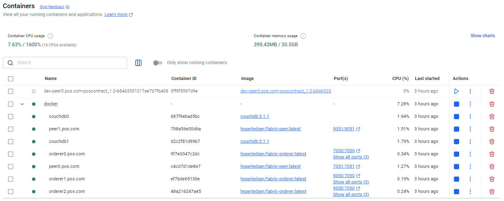
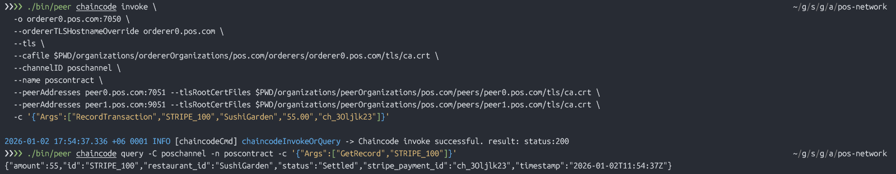
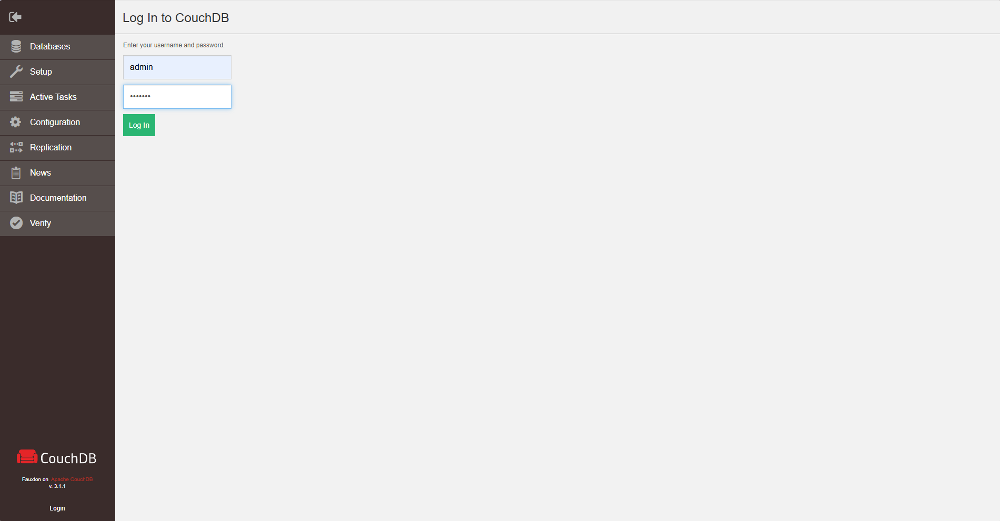
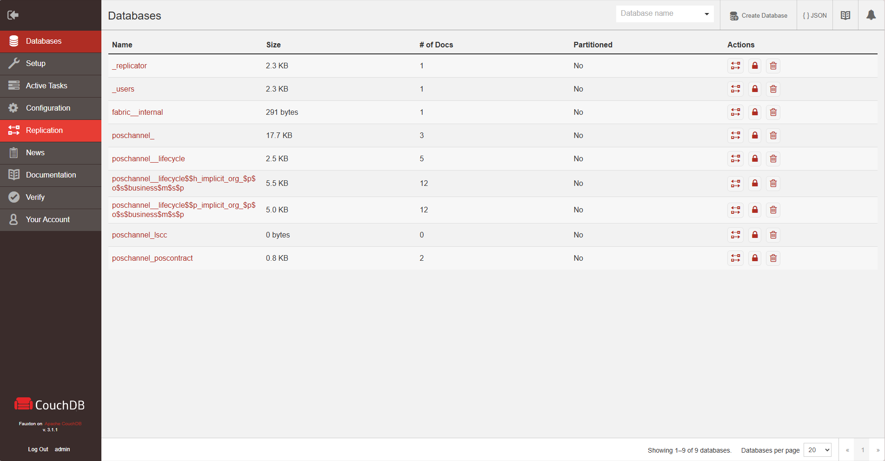
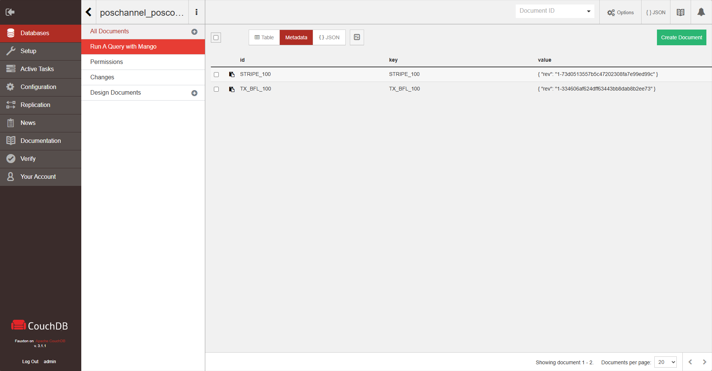

## System Requirement
I'm now contemplating the value of this single-authority blockchain. It's essentially a distributed database, and the audit trail's immutability must be valuable to the client.


I'm currently focused on integrating Hyperledger Fabric into a Point of Sale (POS) system. The aim is to leverage its immutability and integrity for managing transaction and payout data. My current setup involves a single Certificate Authority (CA) and Membership Service Provider (MSP), representing a single authority or organization. There are two peers in place, one designated as an endorser and the other as a committer. For ordering, I'm using three orderers with Raft consensus, and I've selected CouchDB as the state database. Everything is being configured on a single channel.

## Prototype Planning
I am starting from a new directory and create the project from scratch, using `fabric-samples` only as a reference. I'm not using  `fabric-sample` as a template because the `fabric-samples/test-network` is heavily reliant on the `network.sh` script. While `fabric-sample` project is powerful, it is designed specifically for a two-organization setup. Trying to "strip it down" to a one-organization/one-MSP setup will result in broken logic and difficult-to-debug shell script errors. Moreover, `fabric-samples` includes many binaries, environment variables, and chaincode examples that we won’t need. A clean directory ensures developer to understand every file in the architecture.

Note: This prototype project uses `cryptogen` like sample-project but rather `Fabric CAs`. However, in production have to use `Fabric CAs`.

## Prototype Implementation
### Step-1
Create a new directory (e.g., pos-network) and organize it like this:
```
pos-network/
├── organizations/           # Crypto material and CA configs
├── channel-artifacts/       # Genesis block and channel transactions
├── config/                  # configtx.yaml and core.yaml
├── docker/                  # Docker compose files for nodes
├── chaincode/               # our Smart Contract (Go, TS, or Java)
└── application/             # our Node.js/Go backend integration
```

Copy the `bin` and `config` folder from the `fabric-sample` project to the root directory. The directory should look like this:

```
pos-network/
├── organizations/           # Crypto material and CA configs
├── channel-artifacts/       # Genesis block and channel transactions
├── config/                  # configtx.yaml and core.yaml
├── docker/                  # Docker compose files for nodes
├── chaincode/               # our Smart Contract (Go, TS, or Java)
├── application/             # our Node.js/Go backend integration
├── bin/                     # Contains peer, configtxgen, cryptogen, etc.
└── config/                  # Contains core.yaml, orderer.yaml, and configtx.yaml templates to use as a starting point.
```

### Step-2
Now create a `crypto-config.yaml` file in the **root directory**. It is the input for the `cryptogen` tool. Its sole purpose is to generate the x509 certificates and private keys (the "identities") for every component in the network. You can think of this as the "Identity Factory." It creates the digital passports that the Orderers and Peers use to prove who they are.

```
# crypto-config.yaml
OrdererOrgs:
  - Name: Orderer
    Domain: pos.com
    Specs:
      - Hostname: orderer0
      - Hostname: orderer1
      - Hostname: orderer2

PeerOrgs:
  - Name: POSBusiness
    Domain: pos.com
    EnableNodeOUs: true
    Template:
      Count: 2  # This creates peer0 and peer1
    Users:
      Count: 1  # This creates an Admin user
```


To generate the digital certificate, **`run`** this command from the root directory:
```
./bin/cryptogen generate --config=./crypto-config.yaml --output="organizations"
```
After running the fommand, check the organizations folder. It should be full of folders and certificates.

What actually happens is `cryptogen` creates the digital "IDs" (certificates) for your nodes and `configtxgen` takes those IDs and the network rules (from configtx.yaml) and creates the Genesis Block. This block is the "Big Bang" of the blockchain—the very first block that defines who is allowed to participate.


### Step-3
Now modify the `configtx.yaml` file from the `config` folder. The `configtx.yaml` file is one of the most important files in Hyperledger Fabric. It serves as the blueprint for the network. It defines the structure of channels, the participants (organizations), and the rules (policies) they must follow. The updated `configtx.yaml` file should be like this.

```
configtx.yaml
################################################################################
# ORGANIZATIONS
################################################################################
Organizations:
  - &OrdererOrg
    Name: OrdererOrg
    ID: OrdererMSP
    MSPDir: ../organizations/ordererOrganizations/pos.com/msp
    Policies:
      Readers: {Type: Signature, Rule: "OR('OrdererMSP.member')"}
      Writers: {Type: Signature, Rule: "OR('OrdererMSP.member')"}
      Admins:  {Type: Signature, Rule: "OR('OrdererMSP.admin')"}
    OrdererEndpoints:
      - orderer0.pos.com:7050

  - &POSBusinessOrg
    Name: POSBusiness
    ID: POSBusinessMSP
    MSPDir: ../organizations/peerOrganizations/pos.com/msp
    Policies:
      Readers: {Type: Signature, Rule: "OR('POSBusinessMSP.admin', 'POSBusinessMSP.peer', 'POSBusinessMSP.client')"}
      Writers: {Type: Signature, Rule: "OR('POSBusinessMSP.admin', 'POSBusinessMSP.client')"}
      Admins:  {Type: Signature, Rule: "OR('POSBusinessMSP.admin')"}
      Endorsement: {Type: Signature, Rule: "OR('POSBusinessMSP.peer')"}
    AnchorPeers:
      - Host: peer0.pos.com
        Port: 7051

################################################################################
# CAPABILITIES
################################################################################
Capabilities:
  Channel: &ChannelCapabilities
    V2_0: true
  Orderer: &OrdererCapabilities
    V2_0: true
  Application: &ApplicationCapabilities
    V2_0: true

################################################################################
# APPLICATION
################################################################################
Application: &ApplicationDefaults
  Organizations:
  Policies:
    Readers: {Type: ImplicitMeta, Rule: "ANY Readers"}
    Writers: {Type: ImplicitMeta, Rule: "ANY Writers"}
    Admins: {Type: ImplicitMeta, Rule: "MAJORITY Admins"}
    LifecycleEndorsement: {Type: ImplicitMeta, Rule: "MAJORITY Endorsement"}
    Endorsement: {Type: ImplicitMeta, Rule: "MAJORITY Endorsement"}
  Capabilities:
    <<: *ApplicationCapabilities

################################################################################
# ORDERER
################################################################################
Orderer: &OrdererDefaults
  OrdererType: etcdraft
  EtcdRaft:
    Consenters:
      - Host: orderer0.pos.com
        Port: 7050
        ClientTLSCert: ../organizations/ordererOrganizations/pos.com/orderers/orderer0.pos.com/tls/server.crt
        ServerTLSCert: ../organizations/ordererOrganizations/pos.com/orderers/orderer0.pos.com/tls/server.crt
  BatchTimeout: 2s
  BatchSize:
    MaxMessageCount: 10
    AbsoluteMaxBytes: 99 MB
    PreferredMaxBytes: 512 KB
  Organizations:
  Policies:
    Readers: {Type: ImplicitMeta, Rule: "ANY Readers"}
    Writers: {Type: ImplicitMeta, Rule: "ANY Writers"}
    Admins: {Type: ImplicitMeta, Rule: "MAJORITY Admins"}
    BlockValidation: {Type: ImplicitMeta, Rule: "ANY Writers"}

################################################################################
# CHANNEL
################################################################################
Channel: &ChannelDefaults
  Policies:
    Readers: {Type: ImplicitMeta, Rule: "ANY Readers"}
    Writers: {Type: ImplicitMeta, Rule: "ANY Writers"}
    Admins: {Type: ImplicitMeta, Rule: "MAJORITY Admins"}
  Capabilities:
    <<: *ChannelCapabilities

################################################################################
# PROFILES
################################################################################
Profiles:
  POSChannelProfile:
    <<: *ChannelDefaults
    Orderer:
      <<: *OrdererDefaults
      Organizations:
        - *OrdererOrg
      Capabilities:
        <<: *OrdererCapabilities
    Application:
      <<: *ApplicationDefaults
      Organizations:
        - *POSBusinessOrg
      Capabilities:
        <<: *ApplicationCapabilities
```

Above configuration sets up a *Single-Orderer Raft Network* managed by `OrdererOrg` which allows one peer organization, `POSBusinessOrg`, to join the channel. It enforces Fabric *v2.0* rules and uses standard governance where majority of admins are required for major changes, and any member can generally read the ledger. It also prepares a profile named `POSChannelProfile` which you will use to generate the genesis block for our ordering service and the channel creation transaction

Below is a detailed breakdown of this `configtx.yaml` configuration file section by section:

1. **Organizations:** This section defines who the participants are. It maps human-readable names to technical identities (MSPs). Here, we defined one company as the single authority.

    * **OrdererOrg**: Represents the organization managing the ordering service.
        * **MSPDir**: Points to the cryptographic certificates (identities) for this org.
        * **OrdererEndpoints**: Lists the addresses of the three ordering nodes (`orderer0`, `orderer1`, `orderer2`).
    * **POSBusinessOrg**: A peer organization (likely representing a business or retail entity).
        * **AnchorPeers**: Defines `peer0.pos.com` as the anchor peer. Anchor peers are crucial because they allow peers from different organizations to discover each other via the Gossip protocol.
        * **Policies**: Defines roles. For example, to be an `Admin`, you must have a signature from a designated admin identity in `POSBusinessMSP`.

---

2. **Capabilities:** Capabilities ensure that all nodes in the network (peers and orderers) are running at least the specified version of Fabric.
    * **V2_0: true**: This confirms the network uses features introduced in Hyperledger Fabric **v2.0**, such as the new Chaincode Lifecycle.

---

3. **Application:** This section defines default behaviors for transactions and chaincode (smart contracts).
    * **ImplicitMeta Policies**: Instead of checking for a specific signature, these policies check for a result across the whole network. 
        *   `MAJORITY Admins`: Actions like upgrading chaincode require more than 50% of the organizations' admins to agree.
        *   `ANY Readers`: Anyone defined as a reader in their organization can read data.

---

4. **Orderer:** This defines how transactions are ordered and packaged into blocks.
    * **OrdererType: etcdraft**: This uses the **Raft** consensus algorithm, which is the production standard for Fabric.
    * **Consenters**: These are the specific nodes that participate in the Raft "voting" process to reach agreement. There are 3 nodes listed here (`orderer0`, `orderer1`, and `orderer2`) to provide fault tolerance.
    * **BatchSize**: 
        * `MaxMessageCount: 10`: A block will be cut as soon as 10 transactions are received.
        * `AbsoluteMaxBytes: 99 MB`: A block will never exceed this size.
        * `PreferredMaxBytes: 512 KB`: The ideal size the orderer tries to keep blocks under.

---

5. **Channel:** This section defines the policies that govern the channel itself.
    * It uses **ImplicitMeta** policies to decide who can read from the ledger, write to it, or change the channel configuration.

---

6. **Profiles:**
This is where we tell the `configtxgen` tool what to build. Profiles are the "final recipes" used by the `configtxgen` tool to actually create the Genesis Block or the Channel Creation Transaction.

*   **POSChannelProfile**: This is the profile you would call when creating our channel.
    *   It pulls in all the **ChannelDefaults**.
    *   It includes **OrdererOrg** as the manager of the orderer service.
    *   It includes **POSBusinessOrg** as a member of the application channel (the ones who will actually transact and run chaincode).

---


<!-- #### How the system "finds" this file?
This is the most important technical detail: Hyperledger Fabric tools (like `configtxgen`) look for a file named `configtx.yaml` in the directory specified by the environment variable `FABRIC_CFG_PATH`. To generate your genesis block for the channel using this file
```
export FABRIC_CFG_PATH=$PWD/config
./bin/configtxgen -profile POSChannel -outputBlock ./channel-artifacts/genesis.block -channelID mychannel
``` -->


### Step-4

Create a `docker-compose.yaml` file inside the docker folder. This Docker Compose file defines the actual **runtime infrastructure** for the Hyperledger Fabric network that we described in the `configtx.yaml`. With our current configuration it sets up 7 containers: 3 Orderers, 2 Peers, and 2 CouchDB databases. When you run `docker-compose up`, all 7 containers start. The 3 orderers find each other via the `CLUSTER` ports and elect a leader. On the other hand, the peers connect to their respective CouchDB containers to initialize the state database. When it becomes ready, the network waits for user to use the Peer CLI or an SDK to:
*   Create/Join a channel.
*   Deploy Chaincode.
*   Start transacting.

```
pos-network/
├── ...
├── ...
├── docker/docker-compose.yaml          # Docker compose files for nodes
├── ...
└── ...
```

```
# docker-compose.yaml
networks:
  pos_network:
    name: pos_network

services:
  # --- ORDERER 0 ---
  orderer0.pos.com:
    container_name: orderer0.pos.com
    image: hyperledger/fabric-orderer:latest
    environment:
      - FABRIC_LOGGING_SPEC=INFO
      - ORDERER_GENERAL_LISTENADDRESS=0.0.0.0
      - ORDERER_GENERAL_LISTENPORT=7050
      - ORDERER_GENERAL_LOCALMSPID=OrdererMSP
      - ORDERER_GENERAL_LOCALMSPDIR=/etc/hyperledger/fabric/msp
      - ORDERER_GENERAL_TLS_ENABLED=true
      - ORDERER_GENERAL_TLS_PRIVATEKEY=/etc/hyperledger/fabric/tls/server.key
      - ORDERER_GENERAL_TLS_CERTIFICATE=/etc/hyperledger/fabric/tls/server.crt
      - ORDERER_GENERAL_TLS_ROOTCAS=[/etc/hyperledger/fabric/tls/ca.crt]
      # Admin Service
      - ORDERER_ADMIN_LISTENADDRESS=0.0.0.0:7053
      - ORDERER_ADMIN_TLS_ENABLED=true
      - ORDERER_ADMIN_TLS_PRIVATEKEY=/etc/hyperledger/fabric/tls/server.key
      - ORDERER_ADMIN_TLS_CERTIFICATE=/etc/hyperledger/fabric/tls/server.crt
      - ORDERER_ADMIN_TLS_ROOTCAS=[/etc/hyperledger/fabric/tls/ca.crt]
      - ORDERER_ADMIN_TLS_CLIENTAUTHREQUIRED=true
      - ORDERER_ADMIN_TLS_CLIENTROOTCAS=[/etc/hyperledger/fabric/tls/ca.crt]
      - ORDERER_CHANNELPARTICIPATION_ENABLED=true
      # Raft Cluster Settings (MANDATORY BLOCK)
      - ORDERER_GENERAL_CLUSTER_LISTENADDRESS=0.0.0.0
      - ORDERER_GENERAL_CLUSTER_LISTENPORT=7054
      - ORDERER_GENERAL_CLUSTER_SERVERCERTIFICATE=/etc/hyperledger/fabric/tls/server.crt
      - ORDERER_GENERAL_CLUSTER_SERVERPRIVATEKEY=/etc/hyperledger/fabric/tls/server.key
      - ORDERER_GENERAL_CLUSTER_CLIENTCERTIFICATE=/etc/hyperledger/fabric/tls/server.crt
      - ORDERER_GENERAL_CLUSTER_CLIENTPRIVATEKEY=/etc/hyperledger/fabric/tls/server.key
      - ORDERER_GENERAL_CLUSTER_ROOTCAS=[/etc/hyperledger/fabric/tls/ca.crt]
    ports:
      - 7050:7050
      - 7053:7053
      - 7054:7054
    volumes:
      - ../channel-artifacts/poschannel.block:/etc/hyperledger/fabric/poschannel.block
      - ../organizations/ordererOrganizations/pos.com/orderers/orderer0.pos.com/msp:/etc/hyperledger/fabric/msp
      - ../organizations/ordererOrganizations/pos.com/orderers/orderer0.pos.com/tls/:/etc/hyperledger/fabric/tls
    networks:
      - pos_network

  # --- ORDERER 1 ---
  orderer1.pos.com:
    container_name: orderer1.pos.com
    image: hyperledger/fabric-orderer:latest
    environment:
      - FABRIC_LOGGING_SPEC=INFO
      - ORDERER_GENERAL_LISTENADDRESS=0.0.0.0
      - ORDERER_GENERAL_LISTENPORT=7050
      - ORDERER_GENERAL_LOCALMSPID=OrdererMSP
      - ORDERER_GENERAL_LOCALMSPDIR=/etc/hyperledger/fabric/msp
      - ORDERER_GENERAL_TLS_ENABLED=true
      - ORDERER_GENERAL_TLS_PRIVATEKEY=/etc/hyperledger/fabric/tls/server.key
      - ORDERER_GENERAL_TLS_CERTIFICATE=/etc/hyperledger/fabric/tls/server.crt
      - ORDERER_GENERAL_TLS_ROOTCAS=[/etc/hyperledger/fabric/tls/ca.crt]
      - ORDERER_ADMIN_LISTENADDRESS=0.0.0.0:7053
      - ORDERER_ADMIN_TLS_ENABLED=true
      - ORDERER_ADMIN_TLS_PRIVATEKEY=/etc/hyperledger/fabric/tls/server.key
      - ORDERER_ADMIN_TLS_CERTIFICATE=/etc/hyperledger/fabric/tls/server.crt
      - ORDERER_ADMIN_TLS_ROOTCAS=[/etc/hyperledger/fabric/tls/ca.crt]
      - ORDERER_ADMIN_TLS_CLIENTAUTHREQUIRED=true
      - ORDERER_ADMIN_TLS_CLIENTROOTCAS=[/etc/hyperledger/fabric/tls/ca.crt]
      - ORDERER_CHANNELPARTICIPATION_ENABLED=true
      # Raft Cluster Settings (MANDATORY BLOCK)
      - ORDERER_GENERAL_CLUSTER_LISTENADDRESS=0.0.0.0
      - ORDERER_GENERAL_CLUSTER_LISTENPORT=7054
      - ORDERER_GENERAL_CLUSTER_SERVERCERTIFICATE=/etc/hyperledger/fabric/tls/server.crt
      - ORDERER_GENERAL_CLUSTER_SERVERPRIVATEKEY=/etc/hyperledger/fabric/tls/server.key
      - ORDERER_GENERAL_CLUSTER_CLIENTCERTIFICATE=/etc/hyperledger/fabric/tls/server.crt
      - ORDERER_GENERAL_CLUSTER_CLIENTPRIVATEKEY=/etc/hyperledger/fabric/tls/server.key
      - ORDERER_GENERAL_CLUSTER_ROOTCAS=[/etc/hyperledger/fabric/tls/ca.crt]
    ports:
      - 8050:7050
      - 8053:7053
      - 8054:7054
    volumes:
      - ../channel-artifacts/poschannel.block:/etc/hyperledger/fabric/poschannel.block
      - ../organizations/ordererOrganizations/pos.com/orderers/orderer1.pos.com/msp:/etc/hyperledger/fabric/msp
      - ../organizations/ordererOrganizations/pos.com/orderers/orderer1.pos.com/tls/:/etc/hyperledger/fabric/tls
    networks:
      - pos_network

  # --- ORDERER 2 ---
  orderer2.pos.com:
    container_name: orderer2.pos.com
    image: hyperledger/fabric-orderer:latest
    environment:
      - FABRIC_LOGGING_SPEC=INFO
      - ORDERER_GENERAL_LISTENADDRESS=0.0.0.0
      - ORDERER_GENERAL_LISTENPORT=7050
      - ORDERER_GENERAL_LOCALMSPID=OrdererMSP
      - ORDERER_GENERAL_LOCALMSPDIR=/etc/hyperledger/fabric/msp
      - ORDERER_GENERAL_TLS_ENABLED=true
      - ORDERER_GENERAL_TLS_PRIVATEKEY=/etc/hyperledger/fabric/tls/server.key
      - ORDERER_GENERAL_TLS_CERTIFICATE=/etc/hyperledger/fabric/tls/server.crt
      - ORDERER_GENERAL_TLS_ROOTCAS=[/etc/hyperledger/fabric/tls/ca.crt]
      - ORDERER_ADMIN_LISTENADDRESS=0.0.0.0:7053
      - ORDERER_ADMIN_TLS_ENABLED=true
      - ORDERER_ADMIN_TLS_PRIVATEKEY=/etc/hyperledger/fabric/tls/server.key
      - ORDERER_ADMIN_TLS_CERTIFICATE=/etc/hyperledger/fabric/tls/server.crt
      - ORDERER_ADMIN_TLS_ROOTCAS=[/etc/hyperledger/fabric/tls/ca.crt]
      - ORDERER_ADMIN_TLS_CLIENTAUTHREQUIRED=true
      - ORDERER_ADMIN_TLS_CLIENTROOTCAS=[/etc/hyperledger/fabric/tls/ca.crt]
      - ORDERER_CHANNELPARTICIPATION_ENABLED=true
      # Raft Cluster Settings (MANDATORY BLOCK)
      - ORDERER_GENERAL_CLUSTER_LISTENADDRESS=0.0.0.0
      - ORDERER_GENERAL_CLUSTER_LISTENPORT=7054
      - ORDERER_GENERAL_CLUSTER_SERVERCERTIFICATE=/etc/hyperledger/fabric/tls/server.crt
      - ORDERER_GENERAL_CLUSTER_SERVERPRIVATEKEY=/etc/hyperledger/fabric/tls/server.key
      - ORDERER_GENERAL_CLUSTER_CLIENTCERTIFICATE=/etc/hyperledger/fabric/tls/server.crt
      - ORDERER_GENERAL_CLUSTER_CLIENTPRIVATEKEY=/etc/hyperledger/fabric/tls/server.key
      - ORDERER_GENERAL_CLUSTER_ROOTCAS=[/etc/hyperledger/fabric/tls/ca.crt]
    ports:
      - 9050:7050
      - 9053:7053
      - 9054:7054
    volumes:
      - ../channel-artifacts/poschannel.block:/etc/hyperledger/fabric/poschannel.block
      - ../organizations/ordererOrganizations/pos.com/orderers/orderer2.pos.com/msp:/etc/hyperledger/fabric/msp
      - ../organizations/ordererOrganizations/pos.com/orderers/orderer2.pos.com/tls/:/etc/hyperledger/fabric/tls
    networks:
      - pos_network

  # --- PEERS ---
  peer0.pos.com:
    container_name: peer0.pos.com
    image: hyperledger/fabric-peer:latest
    environment:
      - FABRIC_LOGGING_SPEC=INFO
      - CORE_VM_ENDPOINT=unix:///var/run/docker.sock
      - CORE_VM_DOCKER_HOSTCONFIG_NETWORKMODE=pos_network
      - CORE_PEER_ID=peer0.pos.com
      - CORE_PEER_ADDRESS=peer0.pos.com:7051
      - CORE_PEER_LISTENADDRESS=0.0.0.0:7051
      - CORE_PEER_CHAINCODEADDRESS=peer0.pos.com:7052
      - CORE_PEER_CHAINCODELISTENADDRESS=0.0.0.0:7052
      - CORE_PEER_LOCALMSPID=POSBusinessMSP
      - CORE_PEER_MSPCONFIGPATH=/etc/hyperledger/fabric/msp
      - CORE_PEER_TLS_ENABLED=true
      - CORE_PEER_TLS_CERT_FILE=/etc/hyperledger/fabric/tls/server.crt
      - CORE_PEER_TLS_KEY_FILE=/etc/hyperledger/fabric/tls/server.key
      - CORE_PEER_TLS_ROOTCERT_FILE=/etc/hyperledger/fabric/tls/ca.crt
      - CORE_LEDGER_STATE_STATEDATABASE=CouchDB
      - CORE_LEDGER_STATE_COUCHDBCONFIG_COUCHDBADDRESS=couchdb0:5984
      - CORE_LEDGER_STATE_COUCHDBCONFIG_USERNAME=admin
      - CORE_LEDGER_STATE_COUCHDBCONFIG_PASSWORD=adminpw
    volumes:
      - /var/run/docker.sock:/var/run/docker.sock
      - ../organizations/peerOrganizations/pos.com/peers/peer0.pos.com/msp:/etc/hyperledger/fabric/msp
      - ../organizations/peerOrganizations/pos.com/peers/peer0.pos.com/tls:/etc/hyperledger/fabric/tls
    ports:
      - 7051:7051
    networks:
      - pos_network

  peer1.pos.com:
    container_name: peer1.pos.com
    image: hyperledger/fabric-peer:latest
    environment:
      - FABRIC_LOGGING_SPEC=INFO
      - CORE_VM_ENDPOINT=unix:///var/run/docker.sock
      - CORE_VM_DOCKER_HOSTCONFIG_NETWORKMODE=pos_network
      - CORE_PEER_ID=peer1.pos.com
      - CORE_PEER_ADDRESS=peer1.pos.com:9051
      - CORE_PEER_LISTENADDRESS=0.0.0.0:9051
      - CORE_PEER_CHAINCODEADDRESS=peer1.pos.com:9052
      - CORE_PEER_CHAINCODELISTENADDRESS=0.0.0.0:9052
      - CORE_PEER_LOCALMSPID=POSBusinessMSP
      - CORE_PEER_MSPCONFIGPATH=/etc/hyperledger/fabric/msp
      - CORE_PEER_TLS_ENABLED=true
      - CORE_PEER_TLS_CERT_FILE=/etc/hyperledger/fabric/tls/server.crt
      - CORE_PEER_TLS_KEY_FILE=/etc/hyperledger/fabric/tls/server.key
      - CORE_PEER_TLS_ROOTCERT_FILE=/etc/hyperledger/fabric/tls/ca.crt
      - CORE_LEDGER_STATE_STATEDATABASE=CouchDB
      - CORE_LEDGER_STATE_COUCHDBCONFIG_COUCHDBADDRESS=couchdb1:5984
      - CORE_LEDGER_STATE_COUCHDBCONFIG_USERNAME=admin
      - CORE_LEDGER_STATE_COUCHDBCONFIG_PASSWORD=adminpw
    volumes:
      - /var/run/docker.sock:/var/run/docker.sock
      - ../organizations/peerOrganizations/pos.com/peers/peer1.pos.com/msp:/etc/hyperledger/fabric/msp
      - ../organizations/peerOrganizations/pos.com/peers/peer1.pos.com/tls:/etc/hyperledger/fabric/tls
    ports:
      - 9051:9051
    networks:
      - pos_network

  couchdb0:
    container_name: couchdb0
    image: couchdb:3.1.1
    environment: [COUCHDB_USER=admin, COUCHDB_PASSWORD=adminpw]
    networks: [pos_network]

  couchdb1:
    container_name: couchdb1
    image: couchdb:3.1.1
    environment: [COUCHDB_USER=admin, COUCHDB_PASSWORD=adminpw]
    networks: [pos_network]
```

---
Below is the breakdown of the `docker-compose.yaml` file -

1. **The Ordering Service (The Raft Cluster):**
The file defines three orderer nodes (`orderer0`, `orderer1`, `orderer2`). Together, they form a **Raft Consensus Cluster**.

    *   **High Availability:** By having three nodes, the network can survive the failure of one node (Crash Fault Tolerance).
    *   **Key Environment Variables:**
        *   `ORDERER_GENERAL_LOCALMSPID=OrdererMSP`: Matches the ID in our `configtx.yaml`.
        *   `ORDERER_GENERAL_TLS_ENABLED=true`: Communication is encrypted.
        *   `ORDERER_ADMIN_LISTENADDRESS`: Enables the **Admin Service** (typically port 7053). This is used in Fabric v2.x to join channels without needing a "system channel."
        *   **Cluster Settings (Port 7054):** These variables (`ORDERER_GENERAL_CLUSTER_...`) are specific to Raft. They allow the three orderer containers to talk to each other to synchronize blocks.
    *   **Port Mapping:** Notice how they use different host ports to avoid conflicts:
        *   Orderer 0: `7050`
        *   Orderer 1: `8050`
        *   Orderer 2: `9050`

---

2. **The Peers (`peer0` and `peer1`):**
These nodes belong to **POSBusinessOrg**. They store the blockchain ledger and run smart contracts (chaincode).
    *   **Docker-in-Docker:** 
        *   `CORE_VM_ENDPOINT=unix:///var/run/docker.sock`: This allows the peer to talk to our laptop's Docker engine.
        *   **Why?** When we "start" chaincode in Fabric, the peer actually creates a *new* Docker container for that chaincode. It needs access to the Docker socket to do this.
    *   **State Database (CouchDB):** 
        *   `CORE_LEDGER_STATE_STATEDATABASE=CouchDB`: Instead of the default GoLevelDB, this project uses CouchDB.
        *   **Benefit:** CouchDB allows us to perform "Rich Queries" (e.g., searching for all "Sales" where "Amount > 100"). Whereas,  LevelDB only allows simple Key-Value lookups.
    *   **Volumes:** They mount their specific MSP (identity) and TLS certificates so the peer can prove it belongs to `POSBusinessMSP`.

---

3. **State Databases (`couchdb0` and `couchdb1`):**
These are standard CouchDB containers.
    *   Each peer has its **own dedicated** CouchDB container. 
    *   `peer0.pos.com` connects to `couchdb0`.
    *   `peer1.pos.com` connects to `couchdb1`.
    *   They are kept internal to the Docker network (`pos_network`) and are not exposed to our host machine via ports (unless we add them), which is a good security practice.

---

4. **Networking and Storage:**
    *   **Networks:** All containers are joined to `pos_network`. This allows them to resolve each other by name (e.g., `peer0.pos.com` can simply ping `orderer0.pos.com`).
    *   **Volumes (Data Persistence):** 
        *   The line `../channel-artifacts/poschannel.block:/etc/hyperledger/fabric/poschannel.block` is very important. It gives the orderers access to the "Genesis Block" created by the `configtxgen` tool we'd use with our `configtx.yaml`.





---

### Step 5
Running the network

Follow these sequencial commands to run the network. 
#### Step 1: Set the Network to our local machine
For now, we chose the domain `pos.com` for our project. Computers are programmed to check public DNS (the internet) before checking local files. Since `pos.com` is a real website on the internet (hosted by Cloudflare), our computer will try to connect to a server in a data center somewhere else instead of the Docker container on our laptop. In such case, we have two options, always use a `/etc/hosts` override for development domains, or use a non-existent internal domain like `.pos.local`. For now, we chose the formar method.
1.  Open the hosts file: `sudo nano /etc/hosts`
2.  Add this line is at the very bottom:
    ```text
    127.0.0.1 orderer0.pos.com orderer1.pos.com orderer2.pos.com peer0.pos.com peer1.pos.com
    ```
3.  Save and exit (`Ctrl+O`, `Enter`, `Ctrl+X`).
4.  **Verify it (Crucial):** Run `ping -c 1 orderer0.pos.com`.
    *   If it says `64 bytes from 127.0.0.1`, you are **Safe**.
    *   If it still says `172.66...`, it means our computer is ignoring the hosts file. Restart the terminal or flush DNS cache.

---

#### Step 2: Nuclear cleanup to avoid unwanted errors
We must ensure no old data exists in Docker or on our disk. 

1.  **Stop and Wipe Docker:**
    ```bash
    cd docker
    docker-compose down --volumes --remove-orphans
    ```
2.  **Delete old Identity & Artifacts (from project root):**
    ```bash
    cd ..
    rm -rf organizations/ordererOrganizations
    rm -rf organizations/peerOrganizations
    rm -f channel-artifacts/poschannel.block
    ```
    make sure you clean everything to avoid errors:
    ```
    docker rm -f $(docker ps -aq)
    docker system prune -a --volumes
    ```

---


#### Step 3: Regenerate Identity (The "New" Trust)
Now we create a fresh set of IDs.
```bash
./bin/cryptogen generate --config=./crypto-config.yaml --output="organizations"
```

---

#### Step 4: Regenerate the Block (Matching the new IDs)
This step is critical. `configtxgen` will now grab the **newly created** CA fingerprints and put them in the genesis block.
```bash
export FABRIC_CFG_PATH=$PWD/config
./bin/configtxgen -profile POSChannelProfile -outputBlock ./channel-artifacts/poschannel.block -channelID poschannel
```
Optional, If the permission is denied, run this command
```bash
chmod +x ./bin/*
```
---

#### Step 5: Launch the Servers
```bash
cd docker
docker-compose up -d
```
*Wait 5 seconds for the containers to fully initialize.*

---

#### Step 6: Join the Orderer (The Moment of Truth)
Now we need to join the three orderer nodes. This ensures that even if one node goes down, our POS system will continue to process payments. Go back to the **project root**

```
cd ..
```

and run the join command. Since the Block and the Certificates were created 60 seconds ago in the same workflow, they are now mathematically linked.

**Join Orderer 0 (Port 7053)**
```bash
./bin/osnadmin channel join \
  --channelID poschannel \
  --config-block ./channel-artifacts/poschannel.block \
  -o orderer0.pos.com:7053 \
  --ca-file ./organizations/ordererOrganizations/pos.com/orderers/orderer0.pos.com/tls/ca.crt \
  --client-cert ./organizations/ordererOrganizations/pos.com/orderers/orderer0.pos.com/tls/server.crt \
  --client-key ./organizations/ordererOrganizations/pos.com/orderers/orderer0.pos.com/tls/server.key
```

**Join Orderer 1 (Port 8053)**
```bash
./bin/osnadmin channel join \
  --channelID poschannel \
  --config-block ./channel-artifacts/poschannel.block \
  -o orderer1.pos.com:8053 \
  --ca-file ./organizations/ordererOrganizations/pos.com/orderers/orderer1.pos.com/tls/ca.crt \
  --client-cert ./organizations/ordererOrganizations/pos.com/orderers/orderer1.pos.com/tls/server.crt \
  --client-key ./organizations/ordererOrganizations/pos.com/orderers/orderer1.pos.com/tls/server.key
```

**Join Orderer 2 (Port 9053)**
```bash
./bin/osnadmin channel join \
  --channelID poschannel \
  --config-block ./channel-artifacts/poschannel.block \
  -o orderer2.pos.com:9053 \
  --ca-file ./organizations/ordererOrganizations/pos.com/orderers/orderer2.pos.com/tls/ca.crt \
  --client-cert ./organizations/ordererOrganizations/pos.com/orderers/orderer2.pos.com/tls/server.crt \
  --client-key ./organizations/ordererOrganizations/pos.com/orderers/orderer2.pos.com/tls/server.key
```

After joining all three, wait 15–20 seconds for the nodes to perform their Raft election. Then verify they are healthy:
```bash
./bin/osnadmin channel list -o orderer0.pos.com:7053 --ca-file ./organizations/ordererOrganizations/pos.com/orderers/orderer0.pos.com/tls/ca.crt --client-cert ./organizations/ordererOrganizations/pos.com/orderers/orderer0.pos.com/tls/server.crt --client-key ./organizations/ordererOrganizations/pos.com/orderers/orderer0.pos.com/tls/server.key
```
Look for: `"status": "active"`. If it says "inactive", your orderers cannot talk to each other on the cluster port (7054, 8054, etc.).

---

#### Step 7. Verify the Cluster (The "Leader Election")
Now that all 3 nodes have the "Instructions" (the block), they will start talking to each other internally on port **7054**. 

**Wait about 15–20 seconds**, then check if a Raft leader has been elected by viewing the logs of Orderer 0:
```bash
docker logs orderer0.pos.com 2>&1 | grep "Raft leader changed"
```

*Expected Output:* You should see a message like `Raft leader changed from 0 to 1` (or 2 or 3). This confirms the 3 nodes are now a single "brain."

---

#### Step 8: Join Peers
Now we have to move to the nodes that actually hold the POS data.

**Set Environment for Peer 0:**
```bash
export FABRIC_CFG_PATH=$PWD/config
export CORE_PEER_TLS_ENABLED=true
export CORE_PEER_LOCALMSPID="POSBusinessMSP"
export CORE_PEER_TLS_ROOTCERT_FILE=$PWD/organizations/peerOrganizations/pos.com/peers/peer0.pos.com/tls/ca.crt
export CORE_PEER_MSPCONFIGPATH=$PWD/organizations/peerOrganizations/pos.com/users/Admin@pos.com/msp
export CORE_PEER_ADDRESS=peer0.pos.com:7051
```

**Join Peer 0 to Channel:**
```bash
./bin/peer channel join -b ./channel-artifacts/poschannel.block
```

**Switch environment to Peer 1:**
```bash
export CORE_PEER_ADDRESS=peer1.pos.com:9051
export CORE_PEER_TLS_ROOTCERT_FILE=$PWD/organizations/peerOrganizations/pos.com/peers/peer1.pos.com/tls/ca.crt
```

**Join Peer 1 to Channel:**
```bash
./bin/peer channel join -b ./channel-artifacts/poschannel.block
```

---

#### Step 9: Verify the Setup
Check that your peer is successfully on the channel:
```bash
./bin/peer channel list
```
*Expected Output:* `poschannel`.


---

#### Step 10
Congratulations to us. We have successfully built a fully distributed Hyperledger Fabric network with a Raft consensus cluster and CouchDB state storage. Now we will create a `Go` smart contract and follow some steps the steps to get it live.

**1. Create the Chaincode Directory**
From your `pos-network` project root:
```bash
mkdir -p chaincode/poscontract
cd chaincode/poscontract
```

**2. Create the Go Smart Contract**
Create a file named `pos_contract.go` inside that folder:

```
pos-network/
├── ...
├── ...
├── chaincode/               # our Smart Contract (Go, TS, or Java)
    └── poscontract
        └── pos_contract.go
├── ...
└── ...
```


```go
package main

import (
	"encoding/json"
	"fmt"
	"time"

	"github.com/hyperledger/fabric-contract-api-go/contractapi"
)

// SmartContract provides functions for managing POS transactions and Payouts
type SmartContract struct {
	contractapi.Contract
}

// Transaction describes a payment made via Stripe at a restaurant
type Transaction struct {
	ID              string  `json:"id"`
	RestaurantID    string  `json:"restaurant_id"`
	Amount          float64 `json:"amount"`
	StripePaymentID string  `json:"stripe_payment_id"`
	Timestamp       string  `json:"timestamp"`
	Status          string  `json:"status"` // e.g., "Settled", "Refunded"
}

// Payout describes a settlement sent to a restaurant owner
type Payout struct {
	ID           string   `json:"id"`
	RestaurantID string   `json:"restaurant_id"`
	TotalAmount  float64  `json:"total_amount"`
	TxIDs        []string `json:"tx_ids"` // List of transactions included in this payout
	Status       string   `json:"status"` // e.g., "Pending", "Completed"
	PayoutDate   string   `json:"payout_date"`
}

// RecordTransaction adds a new Stripe transaction to the ledger
func (s *SmartContract) RecordTransaction(ctx contractapi.TransactionContextInterface, id string, restaurantID string, amount float64, stripeID string) error {
	tx := Transaction{
		ID:              id,
		RestaurantID:    restaurantID,
		Amount:          amount,
		StripePaymentID: stripeID,
		Timestamp:       time.Now().Format(time.RFC3339),
		Status:          "Settled",
	}
	txBytes, _ := json.Marshal(tx)
	return ctx.GetStub().PutState(id, txBytes)
}

// CreatePayout logs a payout event for a specific restaurant
func (s *SmartContract) CreatePayout(ctx contractapi.TransactionContextInterface, id string, restaurantID string, amount float64, txIDs []string) error {
	payout := Payout{
		ID:           id,
		RestaurantID: restaurantID,
		TotalAmount:  amount,
		TxIDs:        txIDs,
		Status:       "Pending",
		PayoutDate:   time.Now().Format(time.RFC3339),
	}
	payoutBytes, _ := json.Marshal(payout)
	return ctx.GetStub().PutState(id, payoutBytes)
}

// UpdatePayoutStatus updates status to "Completed"
func (s *SmartContract) UpdatePayoutStatus(ctx contractapi.TransactionContextInterface, id string, newStatus string) error {
	payoutBytes, err := ctx.GetStub().GetState(id)
	if err != nil || payoutBytes == nil {
		return fmt.Errorf("payout %s not found", id)
	}

	var payout Payout
	json.Unmarshal(payoutBytes, &payout)
	payout.Status = newStatus

	payoutBytes, _ = json.Marshal(payout)
	return ctx.GetStub().PutState(id, payoutBytes)
}

// GetRecord returns any record by ID (Transaction or Payout)
func (s *SmartContract) GetRecord(ctx contractapi.TransactionContextInterface, id string) (string, error) {
	recordBytes, err := ctx.GetStub().GetState(id)
	if err != nil || recordBytes == nil {
		return "", fmt.Errorf("record %s not found", id)
	}
	return string(recordBytes), nil
}

func main() {
	chaincode, err := contractapi.NewChaincode(&SmartContract{})
	if err != nil {
		fmt.Printf("Error creating POS chaincode: %s", err)
		return
	}

	if err := chaincode.Start(); err != nil {
		fmt.Printf("Error starting POS chaincode: %s", err)
	}
}
```

**3. Initialize Go Module**
Still inside `chaincode/poscontract`:
```bash
go mod init poscontract
go mod tidy
```

---

#### Step 11: Deploying the Chaincode (The "Package & Install")

Now, go back to your **project root** (`pos-network`) with the command `cd ..`. Then we have to run these commands to get the code onto the peers.

Run this command first. On most Linux systems, the Peer container does not have permission to talk to your laptop's Docker engine by default. If the Peer cannot talk to Docker, it cannot "build" the Package 1 you just installed.

```
sudo chmod 666 /var/run/docker.sock
```

**1. Package the chaincode**
This creates a file named `poscontract.tar.gz`.
```bash
./bin/peer lifecycle chaincode package poscontract.tar.gz \
  --path ./chaincode/poscontract/ \
  --lang golang \
  --label poscontract_1.0
```

**2. Install on both peers (Peer 0 and Peer 1)**
You must physically place the code on `every` peer that will participate in the network to execute transactions.

Install on Peer 0:
```bash
# Ensure Peer 0 Env is set:
export FABRIC_CFG_PATH=$PWD/config
export CORE_PEER_TLS_ENABLED=true
export CORE_PEER_LOCALMSPID="POSBusinessMSP"
export CORE_PEER_TLS_ROOTCERT_FILE=$PWD/organizations/peerOrganizations/pos.com/peers/peer0.pos.com/tls/ca.crt
export CORE_PEER_MSPCONFIGPATH=$PWD/organizations/peerOrganizations/pos.com/users/Admin@pos.com/msp
export CORE_PEER_ADDRESS=peer0.pos.com:7051

./bin/peer lifecycle chaincode install poscontract.tar.gz
```

Install on Peer 1:
```bash
# Change env variables to Peer 1
export CORE_PEER_ADDRESS=peer1.pos.com:9051
export CORE_PEER_TLS_ROOTCERT_FILE=$PWD/organizations/peerOrganizations/pos.com/peers/peer1.pos.com/tls/ca.crt

./bin/peer lifecycle chaincode install poscontract.tar.gz
```

**3. Approve and Commit**
Fabric requires organizations to **approve** a chaincode definition before it can be **committed** to a channel. Since you are the only organization, this is simple.

First, find your "Package ID" (you need this for the next command):
```bash
./bin/peer lifecycle chaincode queryinstalled
```
*(Copy the long string that looks like `poscontract_1.0:abc123...`)*

Approve for your Org (Replace [YOUR_PACKAGE_ID] with the string you just copied):
<!-- ```bash
# Replace [PACKAGE_ID] with the string you just copied
./bin/peer lifecycle chaincode approveformyorg 
-o orderer0.pos.com:7050 --channelID poschannel --name poscontract --version 1.0 --package-id [PACKAGE_ID] --sequence 1 --tls --cafile ./organizations/ordererOrganizations/pos.com/orderers/orderer0.pos.com/tls/ca.crt
``` -->
```
./bin/peer lifecycle chaincode approveformyorg \
  -o orderer0.pos.com:7050 \
  --ordererTLSHostnameOverride orderer0.pos.com \
  --channelID poschannel \
  --name poscontract \
  --version 1.0 \
  --package-id [YOUR_PACKAGE_ID] \
  --sequence 1 \
  --tls \
  --cafile $PWD/organizations/ordererOrganizations/pos.com/orderers/orderer0.pos.com/tls/ca.crt
```


Now commit to the Channel. This activates the chaincode on the channel. Because you have 2 peers, we include both in the commit command for endorsement.
<!-- ```bash
./bin/peer lifecycle chaincode commit -o orderer0.pos.com:7050 --channelID poschannel --name poscontract --version 1.0 --sequence 1 --tls --cafile ./organizations/ordererOrganizations/pos.com/orderers/orderer0.pos.com/tls/ca.crt --peerAddresses peer0.pos.com:7051 --tlsRootCertFiles ./organizations/peerOrganizations/pos.com/peers/peer0.pos.com/tls/ca.crt
``` -->
```
./bin/peer lifecycle chaincode commit \
  -o orderer0.pos.com:7050 \
  --ordererTLSHostnameOverride orderer0.pos.com \
  --channelID poschannel \
  --name poscontract \
  --version 1.0 \
  --sequence 1 \
  --tls \
  --cafile $PWD/organizations/ordererOrganizations/pos.com/orderers/orderer0.pos.com/tls/ca.crt \
  --peerAddresses peer0.pos.com:7051 \
  --tlsRootCertFiles $PWD/organizations/peerOrganizations/pos.com/peers/peer0.pos.com/tls/ca.crt \
  --peerAddresses peer1.pos.com:9051 \
  --tlsRootCertFiles $PWD/organizations/peerOrganizations/pos.com/peers/peer1.pos.com/tls/ca.crt
```

---
<a id="test_transaction_anchor"></a>
#### Step 12: Test it (The POS Transaction)
Now that the contract is active, let's record a Stripe transaction in the blockchain.

**Transaction Data:**
*   ID: `STRIPE_100`
*   Restaurant: `SushiGarden`
*   Amount: `55.00`
*   Stripe ID: `ch_3Oljlk23`

```bash
./bin/peer chaincode invoke \
  -o orderer0.pos.com:7050 \
  --ordererTLSHostnameOverride orderer0.pos.com \
  --tls \
  --cafile $PWD/organizations/ordererOrganizations/pos.com/orderers/orderer0.pos.com/tls/ca.crt \
  --channelID poschannel \
  --name poscontract \
  --peerAddresses peer0.pos.com:7051 --tlsRootCertFiles $PWD/organizations/peerOrganizations/pos.com/peers/peer0.pos.com/tls/ca.crt \
  --peerAddresses peer1.pos.com:9051 --tlsRootCertFiles $PWD/organizations/peerOrganizations/pos.com/peers/peer1.pos.com/tls/ca.crt \
  -c '{"Args":["RecordTransaction","STRIPE_100","SushiGarden","55.00","ch_3Oljlk23"]}'
```

---

#### Step 13: Verify Persistence (Querying)
Check that the data is stored in the distributed ledger:

```bash
./bin/peer chaincode query -C poschannel -n poscontract -c '{"Args":["GetRecord","STRIPE_100"]}'
```




#### Step 14: If encountered any error in step 12, try with a new package

**Create a NEW Package (Version 1.1)**
We will change the "Label" so the Peer sees this as a different piece of software.

```bash
# Package with label v2
./bin/peer lifecycle chaincode package poscontract_v2.tar.gz \
  --path ./chaincode/poscontract/ \
  --lang golang \
  --label poscontract_v2
```


**Install the NEW Package**
```bash
# Set Env for Peer 0
export FABRIC_CFG_PATH=$PWD/config
export CORE_PEER_TLS_ENABLED=true
export CORE_PEER_LOCALMSPID="POSBusinessMSP"
export CORE_PEER_TLS_ROOTCERT_FILE=$PWD/organizations/peerOrganizations/pos.com/peers/peer0.pos.com/tls/ca.crt
export CORE_PEER_MSPCONFIGPATH=$PWD/organizations/peerOrganizations/pos.com/users/Admin@pos.com/msp
export CORE_PEER_ADDRESS=peer0.pos.com:7051

./bin/peer lifecycle chaincode install poscontract_v2.tar.gz
```


**Get the NEW Package ID**
```bash
./bin/peer lifecycle chaincode queryinstalled
```
**Look for the one starting with `poscontract_v2:...`** and copy that long string.


**Approve using SEQUENCE 2**
Since the ledger already has a "Sequence 1" committed for `poscontract`, you must increment the sequence to **2**. This tells the Orderers: "Forget about the old version 1.0; we are moving to the new one."

```bash
# Replace [NEW_PACKAGE_ID] with the v2 ID you just copied
./bin/peer lifecycle chaincode approveformyorg \
  -o orderer0.pos.com:7050 \
  --ordererTLSHostnameOverride orderer0.pos.com \
  --channelID poschannel \
  --name poscontract \
  --version 1.1 \
  --package-id [NEW_PACKAGE_ID] \
  --sequence 2 \
  --tls \
  --cafile $PWD/organizations/ordererOrganizations/pos.com/orderers/orderer0.pos.com/tls/ca.crt
```


**Commit SEQUENCE 2**
```bash
./bin/peer lifecycle chaincode commit \
  -o orderer0.pos.com:7050 \
  --ordererTLSHostnameOverride orderer0.pos.com \
  --channelID poschannel \
  --name poscontract \
  --version 1.1 \
  --sequence 2 \
  --tls \
  --cafile $PWD/organizations/ordererOrganizations/pos.com/orderers/orderer0.pos.com/tls/ca.crt \
  --peerAddresses peer0.pos.com:7051 \
  --tlsRootCertFiles $PWD/organizations/peerOrganizations/pos.com/peers/peer0.pos.com/tls/ca.crt
```


**Invoke and Query (The Moment of Victory)**
Wait 10 seconds for the Docker container to spin up, then run:

```bash
./bin/peer chaincode invoke \
  -o orderer0.pos.com:7050 \
  --ordererTLSHostnameOverride orderer0.pos.com \
  --tls \
  --cafile $PWD/organizations/ordererOrganizations/pos.com/orderers/orderer0.pos.com/tls/ca.crt \
  --channelID poschannel \
  --name poscontract \
  --peerAddresses peer0.pos.com:7051 \
  --tlsRootCertFiles $PWD/organizations/peerOrganizations/pos.com/peers/peer0.pos.com/tls/ca.crt \
  -c '{"Args":["RecordTransaction","TX_BFL_100","FinalTest","99.99","stripe_final"]}'
```
Query the trasaction
```bash
./bin/peer chaincode query -C poschannel -n poscontract -c '{"Args":["GetRecord","TX_BFL_100"]}'
```

---
## Running an existing project

First, restart the docker:
```bash
cd docker
docker-compose up -d
```
Then we have to re-authenticate. Because, every time we open a new terminal window or restart our computer, we must "re-authenticate" our session by setting the Fabric environment variables. Since we are targeting `peer0` from `POSBusinessMSP`, we have to run this block of code every time we start a new terminal:
```bash
# Point to the config folder (where core.yaml lives)
export FABRIC_CFG_PATH=$PWD/config

# Set the Peer Identity variables
export CORE_PEER_TLS_ENABLED=true
export CORE_PEER_LOCALMSPID="POSBusinessMSP"
export CORE_PEER_TLS_ROOTCERT_FILE=$PWD/organizations/peerOrganizations/pos.com/peers/peer0.pos.com/tls/ca.crt
export CORE_PEER_MSPCONFIGPATH=$PWD/organizations/peerOrganizations/pos.com/users/Admin@pos.com/msp
export CORE_PEER_ADDRESS=peer0.pos.com:7051
```
Then join peer 1 to the channel.
```
# Set environment for peer1
export CORE_PEER_ADDRESS=peer1.pos.com:9051
export CORE_PEER_TLS_ROOTCERT_FILE=$PWD/organizations/peerOrganizations/pos.com/peers/peer1.pos.com/tls/ca.crt
export CORE_PEER_MSPCONFIGPATH=$PWD/organizations/peerOrganizations/pos.com/users/Admin@pos.com/msp

# Join the channel (assuming you have the poschannel.block file)
./bin/peer channel join -b ./channel-artifacts/poschannel.block
```

Then we can try initiating a new transaction if we want and verify the transactions. For testing, go to: [Step-12](#test_transaction_anchor)


---


# Visualization
Now, let's visualize our world-state-database (couchdb) and the blockchain ledger. 

### Part 1: World State Database (CouchDB) visualization
**Update `docker-compose.yaml` file**

Currently, our CouchDB containers are "hidden" inside Docker. To see the UI (Fauxton), we must map the ports to your local machine.

Update the main **`docker/docker-compose.yaml`** file (`couchdb0` needs port `5984`, and since port `5984` will be taken, we will use `7984` for `couchdb1`):

```yaml
  couchdb0:
    container_name: couchdb0
    image: couchdb:3.1.1
    environment: [COUCHDB_USER=admin, COUCHDB_PASSWORD=adminpw]
    ports:
      - 5984:5984  # <--- Access Peer0's DB at http://localhost:5984/_utils
    networks: [pos_network]

  couchdb1:
    container_name: couchdb1
    image: couchdb:3.1.1
    environment: [COUCHDB_USER=admin, COUCHDB_PASSWORD=adminpw]
    ports:
      - 7984:5984  # <--- Access Peer1's DB at http://localhost:7984/_utils
    networks: [pos_network]
```

**After saving, run:**
```bash
cd docker
docker-compose up -d
```
Now we can go to **`http://localhost:5984/_utils`** login with `username: admin`, `password: adminpw`, and see your business data.





---

### Part 2: Ledger Visualization using Hyperledger Explorer 
**Setup Hyperledger Explorer**


